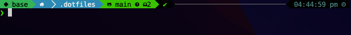
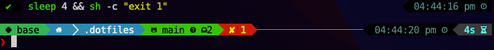

# Graham's Dotfiles

This repo contains a collection of my dotfiles for configuring my shell on Linux and MacOS, and some kubuntu-specific configs.





## New Computer Setup

1. Install or verify dependencies needed to bootstrap:
   - `git`
   - `curl`
   - A system version of Python 3. Anything >= 3.7 should work (bootstrapping will install miniconda)
2. Optionally, run `ssh-keygen` and add the public key to your GitHub account
3. Clone this repo into `.dotfiles`, either over SSH or HTTPS if you don't plan on pushing any changes
    ```shell
    git clone git@github.com:grahamhoyes/dotfiles.git .dotfiles && cd .dotfiles
    ```
4. Run `python3 bootstrap.py` with the desired options to set up a system

For a full first-time set up of a Kubuntu-esque system, run:

```shell
python3 bootstrap.py --full
```

This will perform a system upgrade, install a number of dependencies (including those needed by the script), and configure the shell, system fonts, and some aspects of KDE. A full restart afterwards is required for some changes to take effect.

To only configure the terminal on either Linux or Mac OS, run:

```shell
python3 bootstrap.py --shell --fonts --configs
```

## Modifying Dotfiles

Dotfiles are symlinked to their relevant locations by the bootstrap script, so they can either be modified in this repo (eg `~/.dotfiles/.zshrc`) or by modifying the symlink (eg `~/.zshrc`).

To add a new dotfile:
- Add it to this repo
- Add it to the relevant destination location in the `DOTFILE_LOCATIONS` dictionary in `bootstrap.py`
- Run `python3 bootstrap.py --configs` to create the link
  - The prompts to overwrite existing symlinked dotfiles don't matter, the symlink will just be re-created if you choose to overwrite